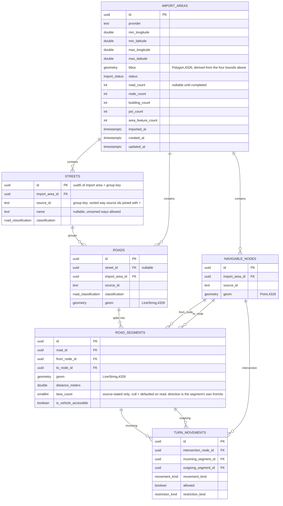
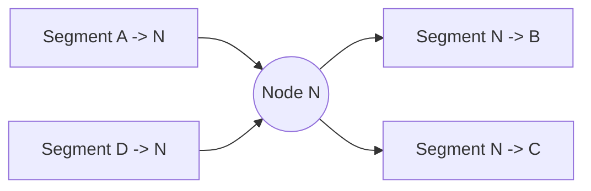
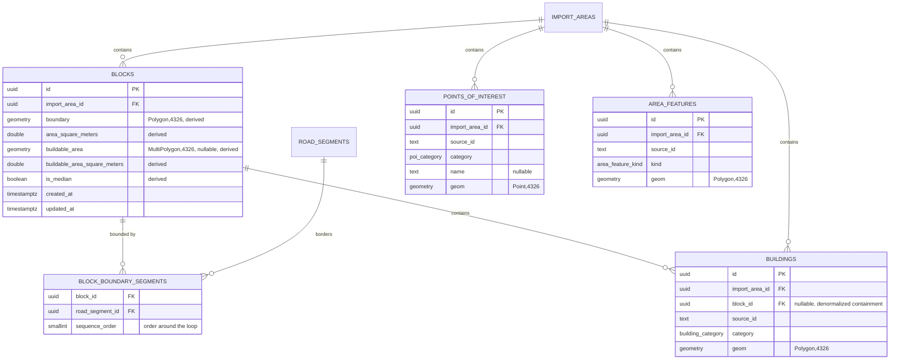

# Persistence schema design

This is design intent for Milestone 2 (domain model and persistence schema), worked out in
consultation before writing migrations. It is not generated from the database — keep it in sync
with `server/alembic/versions/` by hand as the schema evolves.

Primary focus for this project is **block representation and buildings** — the road graph exists
because a block's boundary is derived from it, not because routing is the priority.

## Enums

```sql
CREATE TYPE import_status AS ENUM ('pending', 'importing', 'completed', 'failed');
CREATE TYPE road_classification AS ENUM ('motorway', 'trunk', 'primary', 'secondary', 'tertiary', 'residential', 'service', 'unclassified');
CREATE TYPE building_category AS ENUM ('residential', 'commercial', 'industrial', 'civic', 'unspecified');
CREATE TYPE poi_category AS ENUM ('food_and_drink', 'shopping', 'health', 'education', 'transit', 'other');
CREATE TYPE area_feature_kind AS ENUM ('park', 'water', 'green_space');
CREATE TYPE movement_kind AS ENUM ('left', 'right', 'straight', 'u_turn');
CREATE TYPE restriction_kind AS ENUM ('none', 'no_left_turn', 'no_right_turn', 'no_straight_on', 'no_u_turn', 'only_left_turn', 'only_right_turn', 'only_straight_on');
```

Category value lists are a starting point — extend with `ALTER TYPE ... ADD VALUE` as real OSM
data surfaces more values.

## Road graph and turn movements



**Lane direction**: OSM's `lanes:forward`/`lanes:backward` are relative to the source way's
arbitrary digitization order, not a real-world direction. Once a `Road` is split into
`RoadSegment`s, each segment already has an explicit direction (`from_node -> to_node`), so it
only needs a single `lane_count` for travel in its own direction. The forward/backward split is a
transient ingestion-time translation, never a stored column.

**Generated cross-section**: `lane_count` records only what the source stated. A null value is not
"unknown" to consumers: the cross-section (lanes per direction, lane type, width) is generated on
read by `app/domain/cross_section.py` and marked `defaulted`, so changing a default or a lane width
needs no migration and no re-import.

**Turn movements are dense, not sparse**: ingestion enumerates every geometrically plausible
`(incoming_segment, outgoing_segment)` pair at each node and stores one row per pair, classified
(`left`/`right`/`straight`/`u_turn`) and defaulting `allowed = true` unless an OSM turn-restriction
relation says otherwise. This means routing/graph code queries "legal outgoing segments for this
incoming segment at this node" as a single join — no default-allow logic needed elsewhere, and it
matches `MILESTONES.md`'s Milestone 5 acceptance check that the graph derives legal transitions
directly from this table.



At node `N`: candidate pairs `(A->N, N->B)`, `(A->N, N->C)`, `(D->N, N->B)`, `(D->N, N->C)` each
get a `turn_movements` row. A U-turn (`A->N`, `N->A'`, the opposite-direction segment on the same
road) gets its own row too, defaulting `allowed = false` unless explicitly permitted.

## Blocks and buildings — the primary focus



Key decisions:

- **`Block` is derived, not sourced.** Nothing in OSM tags a block directly. After road ingestion,
  the pipeline nodes and unions `road_segments.geom` and polygonizes it (`ST_Polygonize`); each
  resulting closed ring becomes one `blocks.boundary`. The single unbounded outer face is
  discarded, not stored. `postgis_topology` is already enabled in the local DB (bundled with the
  `postgis/postgis` image) as a more rigorous fallback if `ST_Polygonize` produces gaps/slivers on
  real data, but start with plain `ST_Polygonize`.
- **A block's buildable area is net of its bounding roads (Milestone 7.2).** The boundary follows
  road centerlines, so it includes half of every surrounding road. `buildable_area` is the boundary
  minus each bounding segment buffered, in meters, by half its road's generated 7.1 width. It is
  stored at derivation, so a change to the width constants needs a re-derivation, not a re-import.
  It is `NULL` when nothing is left. A block whose buildable area is nowhere
  `MIN_BUILDABLE_WIDTH_METERS` (5 m) wide, typically a divided road's median, is kept with
  `is_median = true` rather than dropped.
- **`block_boundary_segments` is a real join table, not a `uuid[]` column.** A `road_segment`
  typically borders two blocks (one on each side) or one block plus the "outside" of the import
  area — a plain array on `blocks` can't answer "which blocks touch this segment?" without a full
  scan. The join table gets its own `(block_id, road_segment_id)` uniqueness and an
  FK-enforced `sequence_order` for walking the loop in order.
- **`buildings.block_id` is nullable and denormalized.** Set via `ST_Contains(block.boundary,
  building.geom)` at derivation time. A building near the 1 km bbox edge may sit in a
  partially-captured block whose enclosing loop wasn't fully imported — that is a legitimate
  "unknown," not an error.

## Constraints and indexes

- `UNIQUE (import_area_id, source_id)` on `streets`, `roads`, `navigable_nodes`, `buildings`,
  `points_of_interest`, `area_features`. `provider` lives only on `import_areas` and is reachable
  via `import_area_id`, so it is not duplicated into this tuple. A street is a logical group of
  ways (`app/domain/street_grouping.py`), so its `source_id` is the group key rather than a single
  way's id, and its `id` is derived from the import area and that key.
- `UNIQUE (provider, min_longitude, min_latitude, max_longitude, max_latitude)` on `import_areas`
  — re-importing the same bounding box reuses the same row (updates status/counts/`imported_at`)
  rather than creating a new one; all child entities upsert against that same `import_area_id`.
  (Not a `UNIQUE` on the `bbox` geometry column itself: PostGIS `geometry` has no btree equality
  operator class, so a raw geometry column can't back a `UNIQUE` constraint reliably. The four
  numeric bounds are the identity; `bbox` is derived from them for spatial queries.)
- `UNIQUE (road_id, from_node_id, to_node_id)` on `road_segments`.
- `UNIQUE (incoming_segment_id, outgoing_segment_id)` on `turn_movements`.
- `UNIQUE (block_id, road_segment_id)` on `block_boundary_segments`.
- GiST index on every `geometry` column.
- btree index on every FK column — Postgres does not auto-create these, and graph/derivation
  queries hit `from_node_id`/`to_node_id`/`incoming_segment_id`/`outgoing_segment_id`/`block_id`
  heavily.
- A trigger on `turn_movements` enforcing `incoming_segment.to_node_id = intersection_node_id AND
  outgoing_segment.from_node_id = intersection_node_id` — this can't be a plain `CHECK` since it
  reads other tables, and `MILESTONES.md`'s Milestone 2 acceptance criteria explicitly calls for
  turn movements to enforce valid segment-to-intersection relationships at the schema level.
- Standard `created_at`/`updated_at` on every table.

## Derivation timing (resolved, Milestone 7)

Block derivation and building-to-block linking run automatically, inside every import's own
transaction, after the import reconciles its road segments and before the area is marked
`completed` — not as a separate explicit step. `completed` therefore always implies "blocks are
current". Re-deriving replaces an area's blocks rather than appending to them: an import clears the
area's existing blocks and building links (`BlockDerivationService.clear_for_import_area`) before
deriving afresh. See `openspec/changes/add-application-api/design.md` Decision 1 for the full
ordering and rationale.
